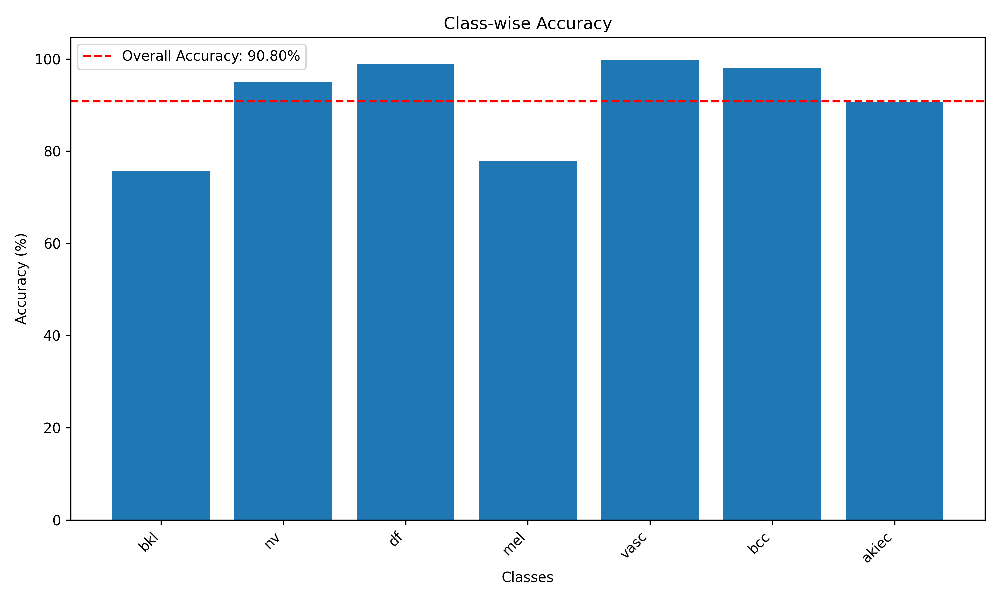

# DCACNet: Skin Cancer Detection System

A deep learning system for skin cancer classification using the HAM10000 dataset with a novel Deep Condensed Attention Convolution Network (DCACNet) architecture.

## Overview

This project implements an advanced skin cancer detection system that can classify skin lesions into 7 different categories. The system uses data augmentation to balance the dataset and employs a custom attention-based CNN architecture for improved classification accuracy.

## Dataset

The system uses the HAM10000 (Human Against Machine with 10,000 training images) dataset, which contains:
- **Total Images**: 10,015 dermatoscopic images
- **Classes**: 7 different types of skin lesions
  - Melanocytic nevi (nv)
  - Melanoma (mel) 
  - Benign keratosis-like lesions (bkl)
  - Basal cell carcinoma (bcc)
  - Actinic keratoses (akiec)
  - Vascular lesions (vasc)
  - Dermatofibroma (df)

### Data Preprocessing & Augmentation

The dataset suffers from class imbalance, which is addressed through intelligent augmentation:

```python
# Augmentation strategy
datagen = ImageDataGenerator(
    rotation_range=20,
    width_shift_range=0.1,
    height_shift_range=0.1,
    shear_range=0.1,
    zoom_range=0.1,
    horizontal_flip=True,
    fill_mode='nearest'
)

# Albumentations for training
train_transforms = A.Compose([
    A.Resize(224, 224),
    A.HorizontalFlip(p=0.5),
    A.RandomBrightnessContrast(p=0.2),
    A.ShiftScaleRotate(shift_limit=0.1, scale_limit=0.1, rotate_limit=15, p=0.5),
    A.Normalize(mean=(0.5, 0.5, 0.5), std=(0.5, 0.5, 0.5)),
    ToTensorV2()
])
```

**Before vs After Augmentation:**


## Model Architecture: DCACNet
### Architecture Flow
```
Input (224×224×3)
    ↓
CondensingLayer (3→32) + ACB (32→64)
    ↓ (112×112×64)
CondensingLayer (64→128) + ACB (128→128)
    ↓ (56×56×128)
CondensingLayer (128→256) + ACB (256→256)
    ↓ (28×28×256)
Global Average Pooling
    ↓ (1×1×256)
Fully Connected Layer (256→7)
    ↓
Output (7 classes)
```

## Training Configuration

```python
# Hyperparameters
EPOCHS = 25
LEARNING_RATE = 1e-3
BATCH_SIZE = 32
PATIENCE = 5  # Early stopping

# Optimizer and Loss
optimizer = torch.optim.Adam(model.parameters(), lr=LEARNING_RATE)
criterion = nn.CrossEntropyLoss()
scheduler = torch.optim.lr_scheduler.ReduceLROnPlateau(optimizer, mode='max', factor=0.5, patience=2)

# Data splits
train_split = 60%
validation_split = 20%
test_split = 20%
```

## Results

### Model Performance

The DCACNet achieved impressive results on the HAM10000 dataset:

- **Test Accuracy**: 90.80%
- **Training completed in**: 25 epochs with early stopping


### Confusion Matrix

*Normalized confusion matrix showing per-class performance*

### ROC Curves

*Multi-class ROC curves with AUC scores for each skin lesion type*

### Class-wise Performance

*Individual class accuracies compared to overall performance*

### Training Progress

*Training and validation loss/accuracy curves showing model convergence*

### Feature Visualization

*Attention feature maps from the final ACB layer showing learned representations*

## Key Features

### 1. **Attention Mechanism**
- Spatial attention in each ACB helps the model focus on relevant skin lesion features
- Improves feature discrimination and reduces noise

### 2. **Progressive Feature Condensation**
- Each condensing layer reduces spatial resolution while increasing feature depth
- Efficient parameter usage and computational cost

### 3. **Data Balancing**
- Smart augmentation strategy to handle class imbalance
- Preserves original data distribution while generating synthetic samples

### 4. **Robust Training**
- Early stopping to prevent overfitting
- Learning rate scheduling for optimal convergence
- Comprehensive evaluation metrics

## Model Advantages

1. **Lightweight Architecture**: Fewer parameters compared to traditional CNNs
2. **Attention-based Learning**: Focuses on diagnostically relevant regions
3. **High Accuracy**: Competitive performance on medical imaging tasks
4. **Interpretable**: Feature visualization shows what the model learns
5. **Scalable**: Can be adapted for other medical imaging tasks

## Requirements

```python
torch>=1.9.0
torchvision>=0.10.0
albumentations>=1.0.0
opencv-python>=4.5.0
pandas>=1.3.0
numpy>=1.21.0
matplotlib>=3.4.0
seaborn>=0.11.0
scikit-learn>=0.24.0
Pillow>=8.3.0
tqdm>=4.62.0
```

## Future Improvements

1. **Ensemble Methods**: Combine multiple DCACNet models for better accuracy
2. **Transfer Learning**: Pre-train on larger dermatology datasets
3. **Multi-scale Analysis**: Process images at different resolutions
4. **Clinical Integration**: Add metadata features (age, gender, location)
5. **Real-time Deployment**: Optimize for mobile/edge devices

## License

This project is licensed under the MIT License - see the [LICENSE](LICENSE) file for details.
